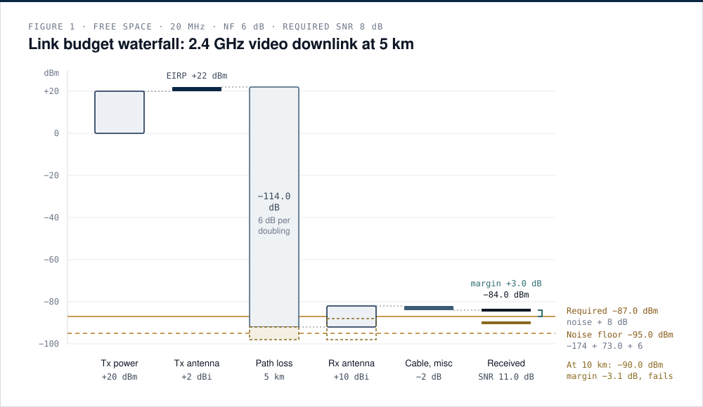

<p align="center"></p>

[](https://github.com/darkanalytica1/rf-link-budget-toolkit/actions/workflows/tests.yml)


## What this is

A small, dependency-free Python package and command-line tool for the decibel arithmetic behind radio links, detection and jamming: wavelength, free-space path loss, EIRP, link budget, thermal noise floor, SNR, radio horizon, Fresnel clearance, communications J/S with burn-through, and GNSS jammer J/S at distance. Every worked example in the documentation is reproduced by a unit test, so the numbers you read are the numbers the code produces.

## Why it matters

Most claims about drone links, detectors and jammers are range claims, and every range claim is a decibel sum. Free-space loss rises 6 dB each time distance doubles; noise rises 3 dB each time bandwidth doubles; a 10 dBi receive antenna is worth ten times the transmitter power; and whether jamming works is decided by the ratio of powers at the victim receiver, not by the jammer's watts. If you can do the sum, you can ask the right question of a datasheet in a meeting: which bands, what EIRP, what bandwidth and noise figure, what required SNR, which receiver is being jammed.

<p align="center"></p>

*Figure 1. Gains lift the signal, free-space loss removes 114 dB over 5 km, and what arrives must clear the noise floor plus the SNR the waveform needs. The dashed red outline is the same link at 10 km, where the margin turns negative.*

## Quick start

```bash
git clone https://github.com/darkanalytica1/rf-link-budget-toolkit
cd rf-link-budget-toolkit
python -m rflink examples          # every worked example, with stated assumptions
python -m rflink fspl --freq-mhz 2400 --dist-km 5
python -m rflink link --freq-mhz 2400 --dist-km 5 --tx-dbm 20 --tx-gain 2 --rx-gain 10 \
                      --bw-hz 20e6 --nf 6 --misc 2 --req-snr 8
python -m rflink js --jam-dbm 40 --jam-gain 12 --tx-dbm 20 --tx-gain 2 \
                    --ds-km 3 --dj-km 1 --rx-bw-hz 20e6 --jam-bw-hz 80e6 --required 10
python -m rflink gnss --jam-dbm 30 --dist-km 10 --lock-loss 30
```

```python
from rflink import fspl_db, LinkBudget, gnss_js

fspl_db(5, 2400)                                   # 114.02 dB
LinkBudget(freq_mhz=2400, dist_km=5, tx_power_dbm=20, tx_gain_dbi=2, rx_gain_dbi=10,
           bandwidth_hz=20e6, noise_figure_db=6, misc_loss_db=2,
           required_snr_db=8).evaluate().margin_db  # +3.0 dB
gnss_js(jammer_power_dbm=30, jammer_gain_dbi=0, dist_km=10).js_db   # 42.1 dB
```

Run the tests with `pip install -r requirements-dev.txt && python -m pytest`.

## Worked examples reproduced by the tests

| Example | Result | Doc |
|---|---|---|
| FSPL, 2.4 GHz, 5 km | 114.0 dB | [01](docs/01-propagation.md) |
| Antenna gain, 30° × 30° beam | 16.6 dBi ideal, 15.2 dBi practical | [01](docs/01-propagation.md) |
| Radio horizon, 2 m to 100 m | 47 km | [01](docs/01-propagation.md) |
| First Fresnel radius, 2.4 GHz, 2 km, mid-path | 7.9 m | [01](docs/01-propagation.md) |
| Video downlink, 2.4 GHz, 5 km | −84.0 dBm, SNR 11.0 dB, margin +3 dB | [02](docs/02-link-budget.md) |
| Same link at 10 km | SNR about 5 dB, margin −3 dB | [02](docs/02-link-budget.md) |
| Uplink jamming, pilot 3 km, jammer 1 km | J/S 33.5 dB, burn-through within 200 m | [03](docs/03-jamming.md) |
| 1 W GNSS jammer at 10 km, L1 | J/S 42.1 dB, denial to about 40 km | [04](docs/04-gnss-jamming.md) |

<p align="center"></p>

*Figure 2. The drone's uplink receiver hears its pilot at 3 km and the jammer at 1 km. Distance ratio, antenna gain and bandwidth mismatch combine into a J/S of 33.5 dB.*

## Method

The package is three modules of pure functions with explicit units in argument names:

| Module | Contents |
|---|---|
| `rflink.propagation` | `wavelength_m`, `fspl_db`, `range_for_loss_km`, `range_factor`, `gain_from_beamwidth_dbi`, `radio_horizon_km`, `fresnel_radius_m` |
| `rflink.budget` | `eirp_dbm`, `noise_floor_dbm`, `shannon_capacity_bps`, `LinkBudget` → `LinkResult` with a step-by-step waterfall |
| `rflink.jamming` | `comms_js_db`, `burn_through`, `gnss_js` with denial distance capped by the horizon |
| `rflink.examples` | the documented worked examples as code, shared by the CLI, the docs and the tests |

The documentation walks through each formula, its variables and a worked example:

1. [Propagation: wavelength, free-space loss, gain and line of sight](docs/01-propagation.md)
2. [Link budget, noise floor and SNR](docs/02-link-budget.md)
3. [Jamming: J/S ratio and burn-through](docs/03-jamming.md)
4. [GNSS jamming at distance](docs/04-gnss-jamming.md)

## Limitations and assumptions

- **Free space only.** Every path is line of sight with a clear first Fresnel zone. Terrain, buildings, foliage, multipath and atmospheric effects are not modelled; add them as explicit extra loss when you can justify a number.
- **Thresholds are assumptions.** The required SNR of a waveform, the J/S at which a link fails and the J/S at which a GNSS receiver loses lock all depend on the specific equipment. The values in the examples are illustrative and labelled as such.
- **Screening, not prediction.** These calculations bound what is physically plausible and expose claims that ignore conditions. They do not replace a measured result under stated conditions.
- **Regulated activity.** Jamming and GNSS interference are illegal without specific authorisation in most jurisdictions. The jamming functions exist to understand geometry and to evaluate claims, not to plan interference.

## Sources

Formulas follow ITU-R P.525, P.526 and P.453, IS-GPS-200, Friis (1946), Balanis, Sklar, Shannon (1948), Adamy (EW 101/102), Poisel, Kaplan and Hegarty, Groves, and Psiaki and Humphreys (2016). Full references and confidence notes: [docs/SOURCES.md](docs/SOURCES.md).

## License

MIT. See [LICENSE](LICENSE).

<sub>DarkAnalytica · public sources and original synthesis · educational use</sub>
